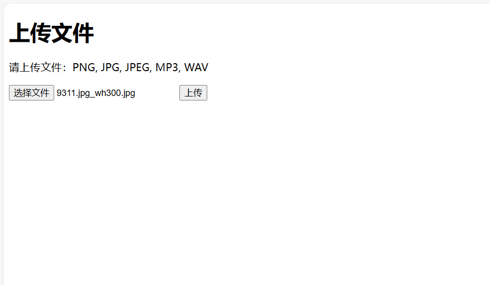
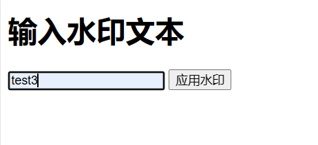
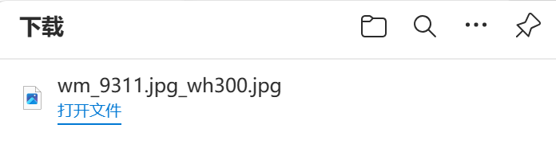
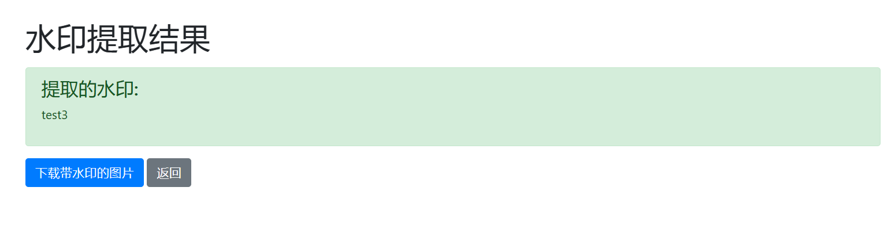

# 图片隐水印添加系统

## 项目介绍

本系统旨在为图片资源提供确权保护，通过嵌入隐形水印来标记图片所有权。该项目实现了一个基于 Flask 的Web应用，用户可以通过简单的用户界面上传图片，并在图片中嵌入自定义的隐形水印文本。嵌入的水印不可见，不影响图片的视觉呈现，且在特定条件下可以被检测出来，用于版权验证。

### 核心功能

- **图片隐水印添加模块**：用户上传图片并输入水印信息，系统将水印信息隐形嵌入图片并提供下载功能。
- **图片隐水印检测模块**：验证已添加水印的图片中的水印信息，确保水印的存在。
- **用户界面**：提供一个简单直观的界面，使用户可以轻松操作水印添加与检测功能。

### 技术说明

- 该系统采用 `blind-watermark` 库作为水印处理的核心算法。
- 通过 Flask 框架搭建了后端服务，并提供了前端界面供用户交互。
- 图片处理的逻辑是不对图片质量造成影响，同时确保水印的安全性和持久性。

## 项目设置

### 使用方法

1. 在浏览器中访问 `http://127.0.0.1:5000/` 来上传图片。

2. 选择图片文件并上传。

3. 输入水印文本并提交。

4. 系统将展示带有水印的图片和原始图片的并列对比。

5. 如果需要，可以提取水印文本来验证。

## 配置文件

- `UPLOAD_FOLDER`: 定义了上传图片的存储路径。
- `OUTPUT_FOLDER`: 定义了处理后的图片存储路径。

## 路由说明

- `/`: 首页，用于上传图片。
- `/upload`: 处理图片上传的 POST 请求。
- `/apply_watermark`: 应用水印到图片并显示结果。
- `/watermark_extraction`: 提取图片中的水印。

## 开发者指南

开发者可以通过修改 `app.py` 和相应的模板来增加新功能或改进现有功能。

## 贡献

如果您有任何改进意见或功能请求，请创建一个 issue 或提交 pull request。

## 许可

该项目使用 [MIT 许可证](LICENSE)。

